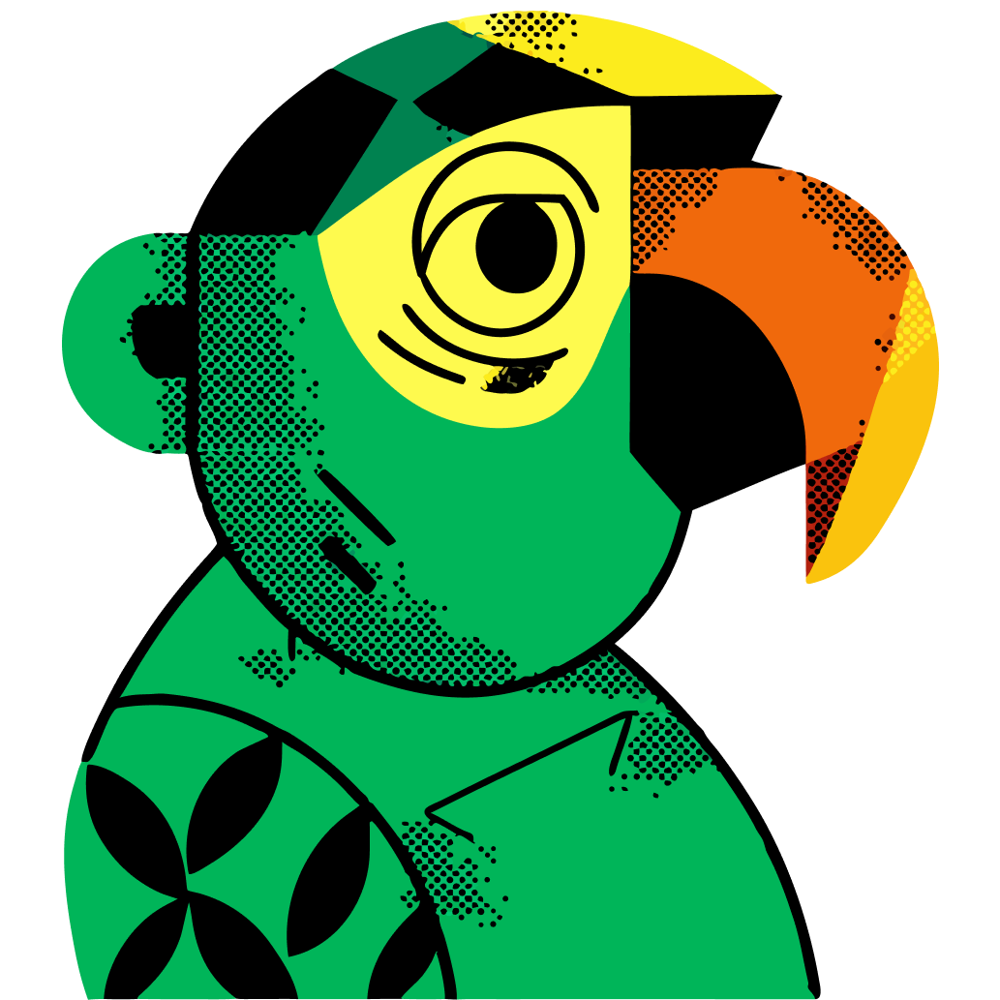

<p align="center">
  
</p>

<h1 align="center">Parrot</h1>

<p align="center">
  A lightweight, high-performance desktop tray prompt manager built using <b>Tauri v2</b>, <b>React</b>, <b>TypeScript</b>, and <b>Tailwind CSS</b>. Securely store, search, and instantly paste frequently used AI prompts or text snippets into any active input field.
</p>

<p align="center">
  <a href="https://tauri.app/"></a>
  <a href="https://react.dev/"></a>
  <a href="https://www.rust-lang.org/"></a>
  <a href="https://microsoft.com/windows"></a>
</p>

---

## Features

- **System Tray Residency**: Runs quietly in your system tray. 
  - **Left-Click**: Toggles the main application popup.
  - **Right-Click**: Launches a beautifully designed, custom dark-themed context menu (avoiding the default, dated Windows context menus) to quickly Open, access Settings, or Quit.
- **Persistent Relocated Position**: Drag the window from any empty space to position it anywhere on your screen. The application remembers your new layout and persists it for all subsequent shows.
- **Global Shortcut Trigger**: Press `Ctrl+Shift+Space` (or your configured custom shortcut) from any application to toggle the window instantly.
- **Inline Typing Trigger**: Type `/parrot:"your-search-query"` inside *any* text editor or browser input. Parrot will slide open near the bottom-right. Selecting a snippet automatically erases the trigger prefix and pastes your content.
- **Auto-Paste Flow**: Intelligently restores focus to your previous active application, waits a brief 150ms to ensure OS window focus transition, and pastes the snippet directly using simulated key strokes.
- **Custom Keyboard Settings**: Modify and save your custom global shortcut inside the settings panel. Changes apply instantly without requiring an app restart.
- **Launch at Startup**: Starts automatically on Windows login. Configurable directly in the Settings menu (handles dev-mode registry constraints gracefully).
- **Local Storage**: Fully offline and stored as structured JSON under `{app_data_dir}/parrot/`—no databases, no network calls, keeping your prompts completely private.
- **Keyboard-First Navigation**:
  - `Arrow Up` / `Arrow Down` to navigate cards.
  - `Enter` to copy text and close.
  - `Shift+Enter` to copy and auto-paste directly into your last active window.
  - `Escape` to close/hide.

---

## Keyboard Navigation & Shortcuts

| Shortcut | Action |
|---|---|
| `Ctrl+Shift+Space` | Toggle Parrot popup (Default, customizable) |
| `Arrow Up` / `Arrow Down` | Navigate prompt cards |
| `Enter` | Copy text of selected prompt to clipboard and close window |
| `Shift+Enter` | Copy + Auto-paste selected prompt directly into previous active window |
| `Escape` | Close/hide window |

---

## Installation

1. Go to the **Releases** tab.
2. Download the latest `Parrot_0.1.0_x64_en-US.msi` installer.
3. Run the installer and launch Parrot from your desktop or start menu.

---

## Build from Source

### Prerequisites

- [Node.js v20+](https://nodejs.org/)
- [Rust toolchain](https://www.rust-lang.org/tools/install) (cargo, rustc, and Windows SDK dependencies)

### Local Development

1. Clone the repository and navigate to the project directory:
   ```bash
   git clone https://github.com/goyalaakarsh/parrot.git
   cd parrot
   ```
2. Install frontend dependencies:
   ```bash
   npm install
   ```
3. Run the application in development mode:
   ```bash
   npm run tauri dev
   ```

### Production Packaging

Compile the React frontend assets and package the production executable:
```bash
npm run tauri build
```
The final installer and standalone executable will be located in:
`src-tauri/target/release/bundle/`

---

## License

This project is licensed under the MIT License. See [LICENSE](LICENSE) for details.
